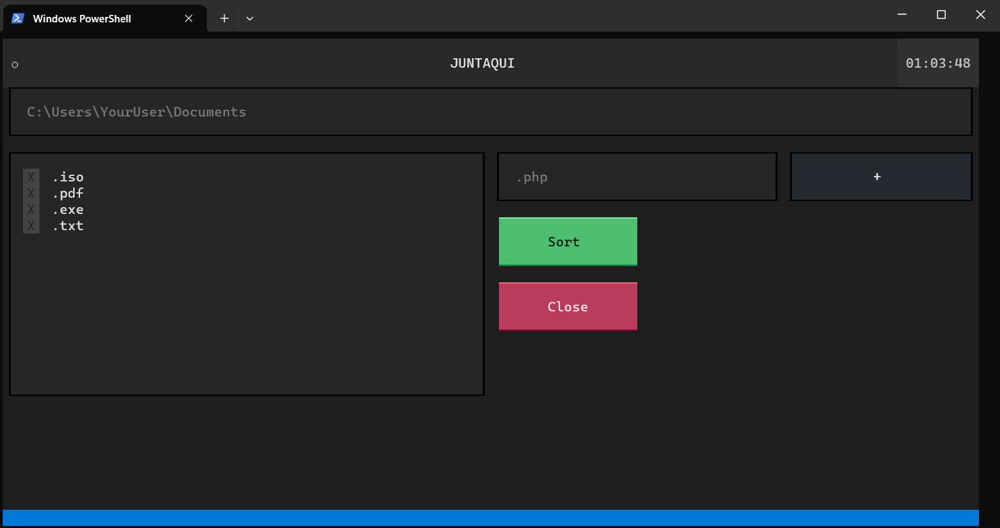

# Juntaqui

---
Other documentation languages:

---

This TUI (Terminal User Interface) can sort your files into folders created by the name of their extension.

You just need to enter a valid path, select the file extensions or add a new one and press the sort button.

Feel free to send sugestions!

(Actually, only work in computers with Python and the dependences installed correctly)

Guide to run in Powershell without executable file:
- Open the project folder and run the next commands
- `python -m venv .venv`, to create the enviorment
- `.venv/Scripts/activate`, to activate the enviorment
- `pip install -r requirements.txt`, to install the dependences
- `python -m main`, to run this application

_Soon:_
- executable file
- ...